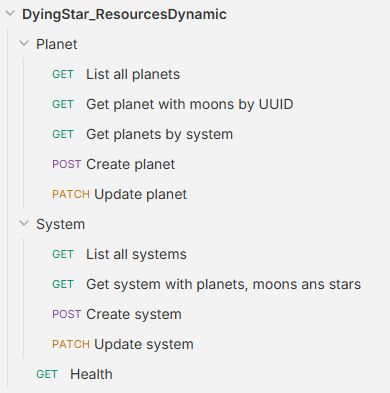
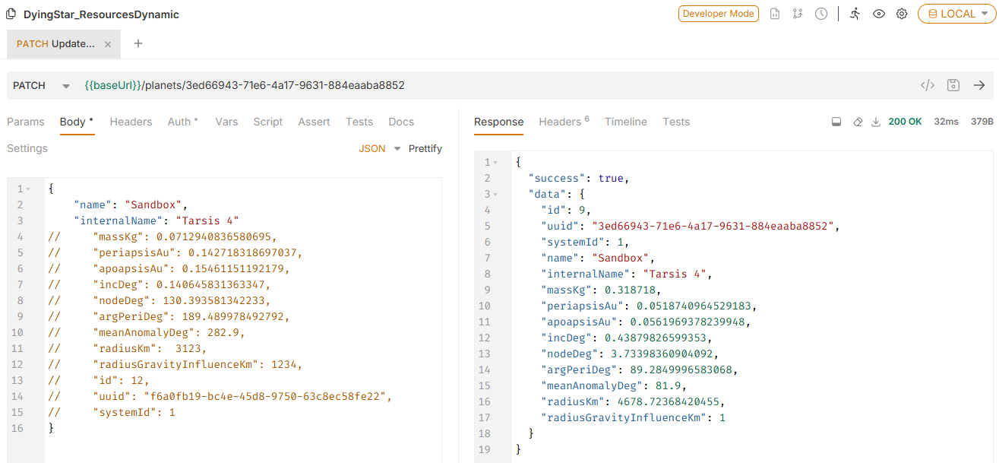
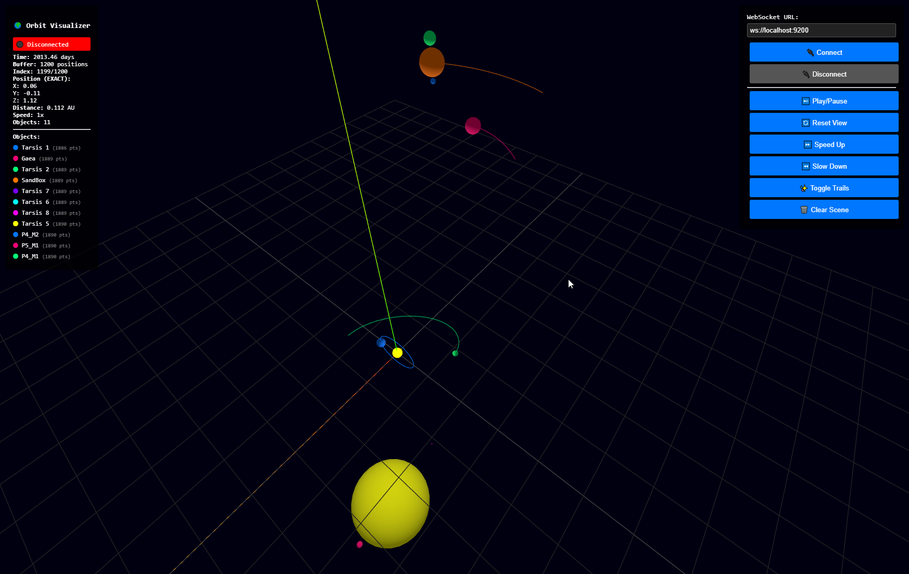

# DyingStar Resources Dynamic Service

## Local Development

### Requirements

- [Docker](https://www.docker.com/get-started) OR [Podman](https://podman.io/)
- [Docker Compose](https://docs.docker.com/compose/install/) OR [Podman Compose](https://docs.podman.io/en/latest/markdown/podman-compose.1.html)
- [Make](https://www.gnu.org/software/make/) to use the provided Makefile

## Setup

Copy `.env.example` to `.env` and fill in the required environment variables

### Development

1. Run `make up` This will start containers Postgres + Node (use for `make pnpm` command).
2. Run `make pnpm i` to install dependencies.
3. Run `make db-migrate` to execute migration scripts.
4. Run `make db-import-system` to import systems from `data/system/` folder
5. Run `make pnpm dev` to start development server.
6. To stop the server, stop the Docker container with `make down`.

### Testing

1. Run `make start` to start the server. This will install dependencies, start containers and execute migration scripts.
2. Run `make db-import-system` to import systems from `data/system/` folder
3. To stop the server, stop the Docker container with `Ctrl+C` in the terminal where `make start` was run.

## Database

A clean SQL is available in `documentation/sql/cleanBdd.sql`. It must be executed with an SQL client (e.g., [DBeaver](https://dbeaver.io/)).

**Info**: All UUID updates are used for the [Orbit Visualizer](#bonus) because the radius of elements (e.g., planets, stars) are hard-coded into the code.

## WebSocket

- if `ENABLE_MSG_PACK=true` All requests message **must be encoded** with [msgpack](https://msgpack.org/)
- if `ENABLE_MSG_PACK=true` All responses message are encoded with [msgpack](https://msgpack.org/)

### Message "Connected"

Message received after connection

#### Response :

```json
{
  "clientId": "<string>",
  "timestamp": "<number>",
  "type": "connected"
}
```

- **clientId** : Generated dynamically upon connection

---

### Message "Init"

Used to retrieve all information concerning stellar objects, including their position and rotation at T0.

#### Request :

```json
{
  "event_type": "init",
  "data": {
    "system_internal_name": "<string>",
    "duration_s": "<number>",
    "frequency": "<number>",
    "from_timestamp": "<number>"
  }
}
```

- **system_internal_name** : Internal name of system (ex: tarsis)

#### Response :

```json
{
  "namespace": "genericprops",
  "event": "create_object",
  "data": [{
    "object_type": "planet | moon | system | star",
    "object_uuid": "<uuid>",
    "object_data": {
      "name": "<string>",
      "scenename": "<string>",
      "parent_id": "<uuid>",
      "from_timestamp": "<number>",
      "positions": [
        {
          "x": "<number>",
          "y": "<number>",
          "z": "<number>"
        }
      ],
      "rotations": [
        {
          "x": "<number>",
          "y": "<number>",
          "z": "<number>",
          "w": "<number>"
        }
      ],
    }
  }]
}
```

- **parent_id** : Empty for "system"
- **positions** : Missing for "system" and "star" (Vector3)
- **rotations** : Missing for "system" and "star" (Quaternion)

---

### Message "transform"

Used to retrieve the transforms of a stellar object by UUID, specifying the start time and the frequency.

#### Request :

```json
{
  "event_type": "transform",
  "data": {
    "uuid": "<uuid>",
    "duration_s": "<number>",
    "frequency": "<number>",
    "from_timestamp": "<number>"
  }
}
```

- **uuid**: Object uuid
- **duration_s** : Duration (in seconds)
- **Frequency** : Frequency (Hz)
- **from_timestamp**: Start from timestamp

#### Response :

```json
{
  "namespace": "genericprops",
  "event": "update_object",
  "data": {
    "object_type": "planet | moon",
    "object_uuid": "<uuid>",
    "object_data": {
      "from_timestamp": "<number>",
      "positions": [
        {
          "x": "<number>",
          "y": "<number>",
          "z": "<number>"
        }
      ],
      "rotations": [
        {
          "x": "<number>",
          "y": "<number>",
          "z": "<number>",
          "w": "<number>"
        }
      ]
    }
  }
}
```

## Notes

- The development server supports hot-reloading, so any changes you make to the code will automatically be reflected in the terminal.
- If you need to install new dependencies, you can do so by running `make pnpm add <package-name>` or `make pnpm "add -D <package-name>"` for dev dependencies.
- If you need test, you can modify `src/client.ts` and run `make pnpm client` for create WebSocket client.

## API Rest

To make API calls, a collection for [Bruno](https://www.usebruno.com/) software is available in the `.bruno` directory at root.



All endpoints contain an example :



## BONUS

Test Websocket with [Orbit Visualizer 🔮](documentation/orbitVisualizer.html) (no need server, just open file)

1. Start server with `make pnpm dev` or `make pnpm build && make pnpm start`
2. Click `Connect`



---

🧙‍♂️ Straight outta the cave — with love ❤️
